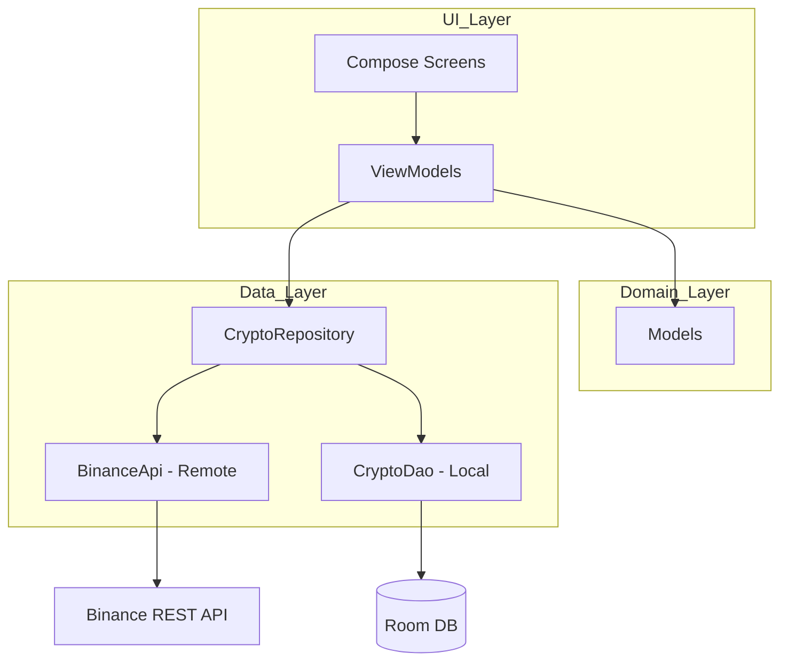

> **您的智能投资伴侣，毫秒级行情追踪与全方位预警。**

在波诡云谲的加密市场中，精准的信息就是财富。“加密货币价格监测器”是一款专为现代投资者打造的高性能 Android 移动应用。它不仅提供了极速的行情追踪，还集成了深度的个性化管理与自动化预警机制，助您告别频繁盯盘的焦虑，精准捕捉每一次市场机会。

## 核心功能

### 🚀 极速行情，尽在掌握
直连币安 (Binance) 全球 API，提供主流币种及海量代币的实时价格流。配合灵动的个性化列表，支持自由排序、滑动管理及批量编辑，打造专属于您的“数字资产观察哨站”。

### 📊 专业级 K 线分析
深度集成高性能图表库，支持从 1 分钟到 1 月线的全周期切换。无论是流畅的手势缩放平移，还是精准的十字准星高亮查价，都能让您像专业分析师一样洞察趋势。

### 🔔 智能预警，守候机会
随心设置您的“心理价位”或“涨跌比例”，系统将在后台为您忠实守候。利用 WorkManager 与前台服务技术，确保在睡梦中或忙碌间，只要触及目标，即时的通知推送将第一时间为您送达。

### 🛠️ 丝滑体验，极致稳定
- **Modern UI**：采用最新的 Jetpack Compose 响应式架构与 Material 3 设计规范，界面纯净灵动。
- **动态优化**：内置智能 API 路由切换机制，支持多种线路选择，确保在全球任何环境下都能拥有极速稳定的连接体验。

---

无论是长线资产配置还是短线突击交易，**加密货币价格监测器**都是您最可靠的决策辅助。立即体验，让投资变得更简单、更从容！

# CryptoAlert 项目技术文档

## 1. 项目概述

CryptoAlert 是一款基于 Android 平台的加密货币价格监控与提醒应用程序。它利用币安（Binance）API 获取实时市场数据，为用户提供关注列表、详细行情、交互式 K 线图表以及多维度的价格提醒功能。

### 核心价值
- **实时性**：通过高频轮询和前台服务确保价格监控的实时性。
- **可靠性**：内置动态 API 路由机制，自动处理网络连接问题和区域限制。
- **交互性**：提供功能丰富的 K 线图表，支持多种周期和技术指标。

---

## 2. 技术栈

| 类别 | 技术选型 |
| :--- | :--- |
| **编程语言** | Kotlin |
| **UI 框架** | Jetpack Compose (声明式 UI) |
| **异步处理** | Kotlin Coroutines & Flow |
| **依赖注入** | Hilt (Dagger) |
| **网络请求** | Retrofit 2 + OkHttp 3 + GSON |
| **本地数据库** | Room Persistence Library |
| **背景任务** | WorkManager & Foreground Service |
| **图表库** | MPAndroidChart (集成至 Compose) |
| **图片加载** | Coil |

---

## 3. 架构设计

项目遵循 **Clean Architecture** 原则，并采用 **MVVM (Model-View-ViewModel)** 模式。

### 3.1 层次结构
- **Data 层**：负责数据获取和持久化。包含 Retrofit 接口、Room 数据库定义及 Repository 的实现。
- **Domain 层**：定义核心业务模型（Entities）和业务逻辑。
- **UI 层**：负责视图渲染。包含 Compose Screens 和对应的 ViewModels。

### 3.2 架构图

---

## 4. 核心功能实现

### 4.1 动态 API 路由 (China Fix)
为了应对特定区域的网络不稳定，项目实现了 `DynamicBaseUrlInterceptor`。
- **机制**：拦截所有 API 请求，若当前域名连接失败，则自动按优先级尝试备用域名列表（如 `api1.binance.com`, `api.binance.vision` 等）。
- **持久化**：成功连接的域名会被保存至 `SharedPreferences`，作为下次请求的首选域名。

### 4.2 价格监控服务 (PriceMonitorService)
采用 Android 前台服务（Foreground Service）确保监控在后台不被系统杀死。
- **执行逻辑**：
  1. 每隔一分钟（可配置）轮询一次用户设置的所有提醒。
  2. 从 Binance API 获取最新价格。
  3. 对比提醒条件：高于某价、低于某价、涨幅、跌幅。
  4. 触发条件时，通过 `NotificationHelper` 发送系统通知并记录 `AlertHistory`。

### 4.3 交互式 K 线图 (ChartScreen)
集成 `MPAndroidChart` 库并封装在 Compose 的 `AndroidView` 中。
- **功能特性**：
  - **多周期支持**：15m, 1h, 4h, 1d, 1w 等。
  - **技术指标**：内置 MA5, MA10, MA20 均线计算。
  - **交互增强**：支持双指缩放、拖拽平移、十字线高亮显示详细数据面板。
  - **延迟加载**：滑动到图表左侧时自动触发加载历史 K 线数据。

---

## 5. 数据库设计

项目使用 Room 数据库，包含以下核心表结构：

- **alerts**：存储用户的价格提醒设置。
  - `symbol`, `abovePrice`, `belowPrice`, `risePercent`, `fallPercent`, `isEnabled`。
- **favorite_coins**：存储用户关注的币种。
  - `symbol`, `name`, `orderIndex` (支持排序)。
- **alert_history**：存储已触发的提醒记录。
  - `symbol`, `message`, `timestamp`。

---

## 6. 开发环境与配置

- **IDE**: Android Studio Jellyfish (或更高版本)
- **SDK**: Compile SDK 34, Min SDK 24
- **Gradle**: Kotlin DSL (build.gradle.kts)
- **网络配置**: `network_security_config.xml` 中配置了必要的域名白名单，支持明文/加密通信的灵活切换。

---
